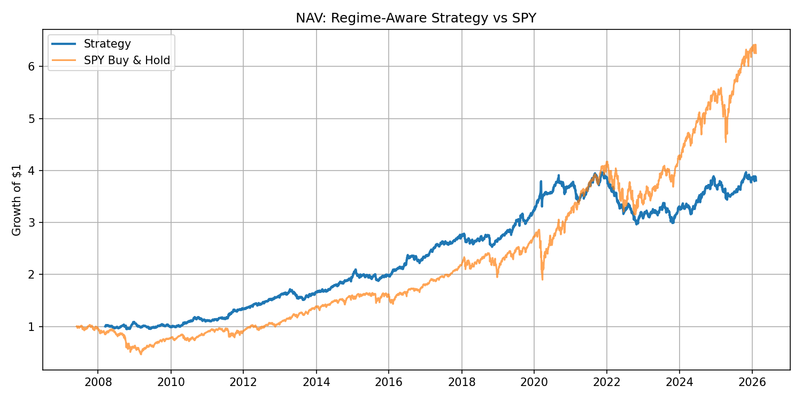
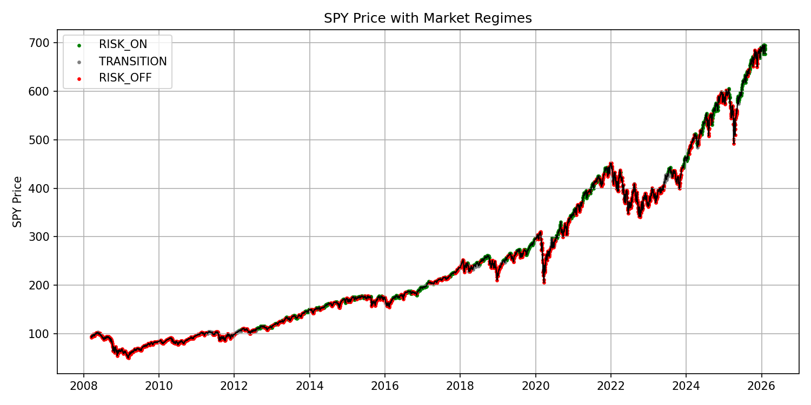

# Regime-Aware Volatility & Asset Allocation System

A medium-frequency systematic trading strategy that dynamically allocates capital across equities, bonds, and cash based on interpretable market regime signals.  
The system prioritizes **risk control, interpretability, and robustness** over return maximization.

---

## Performance Overview

---

## Motivation

Financial markets exhibit distinct regimes (e.g., low-volatility risk-on vs high-volatility risk-off).  
Strategies that ignore regime shifts often experience severe drawdowns during periods of stress.

This project explores whether **simple, transparent regime signals**, combined with disciplined risk management, can meaningfully improve risk-adjusted performance and drawdown behavior.

---

## Asset Universe

The strategy allocates among highly liquid ETFs:

- **SPY** — U.S. equities  
- **TLT** — long-duration U.S. Treasury bonds  
- **BIL** — short-term Treasury bills (cash proxy)

These instruments minimize liquidity and execution concerns while enabling clear interpretation of portfolio risk exposure.

---

## Feature Engineering & Regime Detection

Market regimes are inferred using only information available at time *t* (no look-ahead bias):

- Rolling volatility (20-day, 60-day)
- Long-term trend (price relative to 200-day moving average)
- Drawdown from rolling peak
- Volatility-of-volatility proxy

Regimes are labeled using interpretable, rule-based logic:

- **Risk-On**: low volatility, positive long-term trend, shallow drawdowns  
- **Risk-Off**: elevated volatility, negative trend, or deep drawdowns  
- **Transition**: intermediate states

The design intentionally avoids black-box models to maintain economic intuition and explainability.

---

## Allocation & Risk Management

Each regime maps to a base allocation across SPY, TLT, and BIL.  
Portfolio risk is managed through:

- Volatility targeting (≈ 10% annualized target)
- Leverage caps and position limits
- Transaction cost and slippage modeling
- Periodic (weekly) rebalancing

Risk management is treated as a **first-class component**, not an afterthought.

---

## Backtesting Methodology

- Daily return simulation with weekly rebalancing
- Strict avoidance of look-ahead bias (weights applied using prior-day information)
- Transaction costs modeled via basis-point turnover costs
- Performance evaluated using CAGR, volatility, Sharpe ratio, and maximum drawdown

---

## Results (Representative)

- **Annualized Return:** ~7.8%  
- **Annualized Volatility:** ~9.4%  
- **Sharpe Ratio:** ~0.87  
- **Maximum Drawdown:** ~25%  

Results are intentionally conservative and emphasize robustness over curve-fitting.

---

## Walk-Forward Validation

To evaluate temporal robustness, the strategy was tested using walk-forward validation:

- Regime logic defined using historical windows
- Strategy performance evaluated only on subsequent, unseen periods
- Multiple rolling train/test windows analyzed

Performance varies across windows, but **risk metrics remain stable**, suggesting reasonable generalization across changing market environments.

---

## Crisis Stress Testing

The strategy was explicitly stress-tested during major market dislocations:

- **2008 Global Financial Crisis**
- **2020 COVID-19 market crash**

While returns varied during these periods, the system demonstrated **materially improved drawdown control relative to equity buy-and-hold**, reflecting effective regime-based de-risking during high-volatility environments.

---

## Project Structure

quant_system/
├── data/          # raw and cleaned price data
├── features/      # regime feature engineering
├── strategies/    # allocation logic
├── risk/          # volatility targeting and constraints
├── backtest/      # backtesting engine
├── notebooks/     # analysis and visualization
├── run.py         # end-to-end pipeline
└── README.md

---

## Limitations & Future Work

- Regime rules are static; future work could explore walk-forward calibration of thresholds
- Asset universe is intentionally limited; extensions could include additional factors
- Execution model assumes end-of-day fills and simplified transaction costs

---

## Design Philosophy

This project intentionally avoids direct price prediction and black-box machine learning.  
Instead, it focuses on **market structure, regime awareness, and disciplined risk control**, reflecting practical constraints faced by real-world systematic strategies.